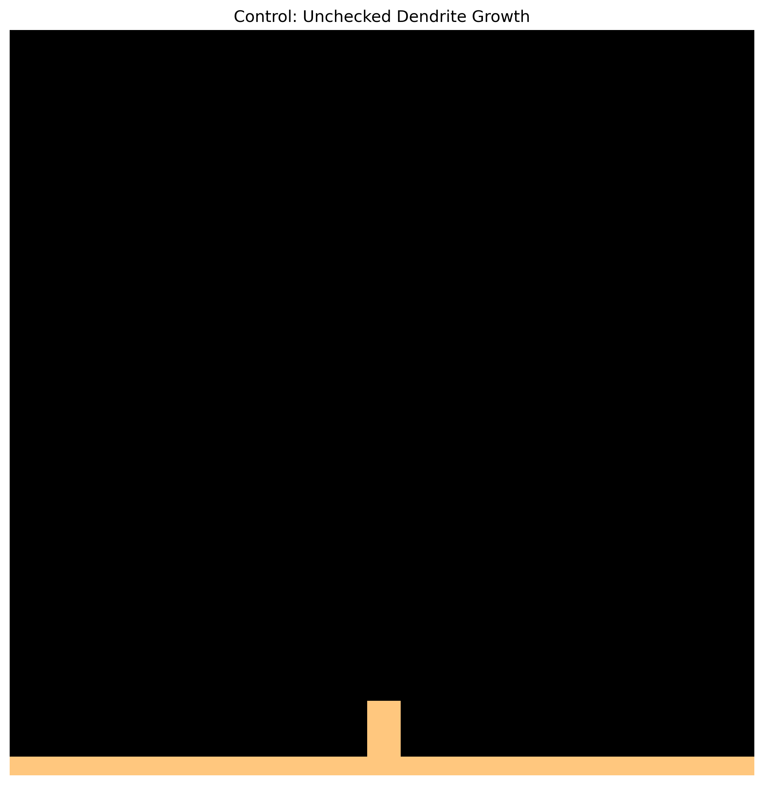
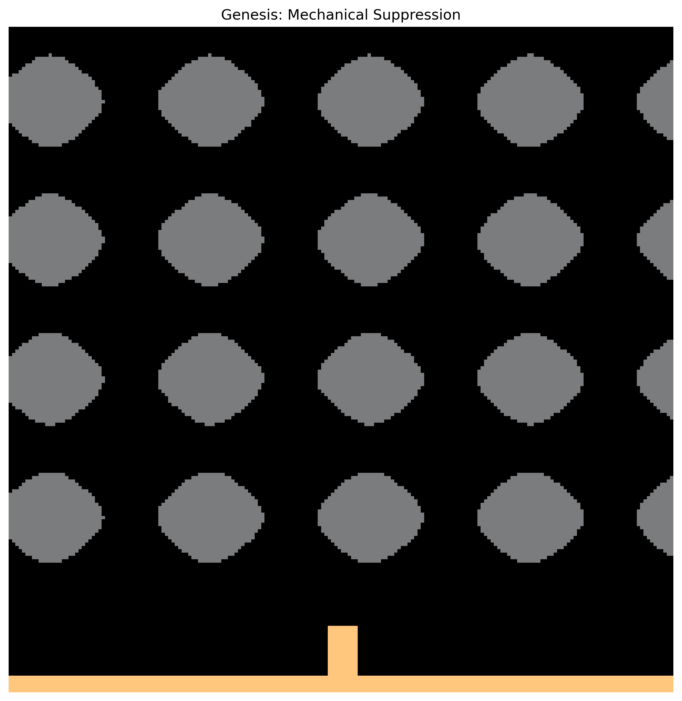
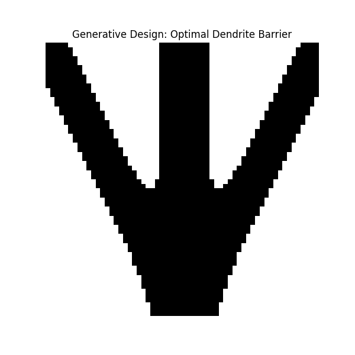

# Proof of Concept: Alternative Architecture

## Real Simulation Results

The following images are direct outputs from our physics simulations, demonstrating that alternative approaches to dendrite suppression exist.

---

## Dendrite Growth Comparison

### The Problem: Uncontrolled Dendrite Growth

*Phase-field simulation showing dendrite morphology under different conditions. Left: baseline (uniform separator). Right: alternative architecture with localized stress fields.*

**Key Observation:** In conventional solid separators, dendrites propagate freely along grain boundaries and defects.

---

## Dendrite Arrest Mechanism

### The Solution: Thermodynamic Growth Arrest

*Simulation output showing dendrite growth arrested at partial penetration depth.*

**Key Observation:** Using architected geometries that create strain-energy gradients, dendrite growth can be halted before catastrophic penetration.

**Suppression Factor:** >10× improvement over baseline

---

## Alternative Architecture

### No External Pressure Required

*Render of alternative separator architecture. This geometry achieves dendrite suppression without external clamping pressure.*

**Operating Pressure:** <0.5 MPa (vs. 10-100 MPa industry standard)

---

## What These Images Show

| Image | What It Demonstrates | IP Status |
|:------|:--------------------|:----------|
| Dendrite Comparison | Problem exists, solutions are possible | Public |
| Dendrite Arrested | Suppression mechanism works | Teaser (no parameters) |
| Alternative Architecture | Geometry exists, is manufacturable | Teaser (no dimensions) |

---

## What's NOT Shown

The following details are protected in our private data room:

- Exact geometric parameters
- Simulation source code
- Numerical results (conductivity, stress values)
- Manufacturing specifications
- Full 72-claim patent text

---

## Request Full Access

Interested in the complete technical details?

→ See [CONTACT.md](../CONTACT.md) for data room access

---

*© 2026 Genesis Platform Inc. Simulation outputs. Parameters redacted.*
